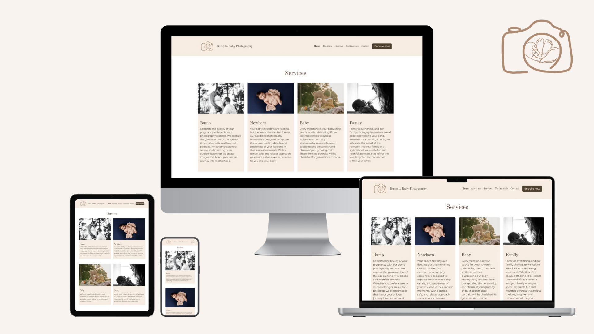
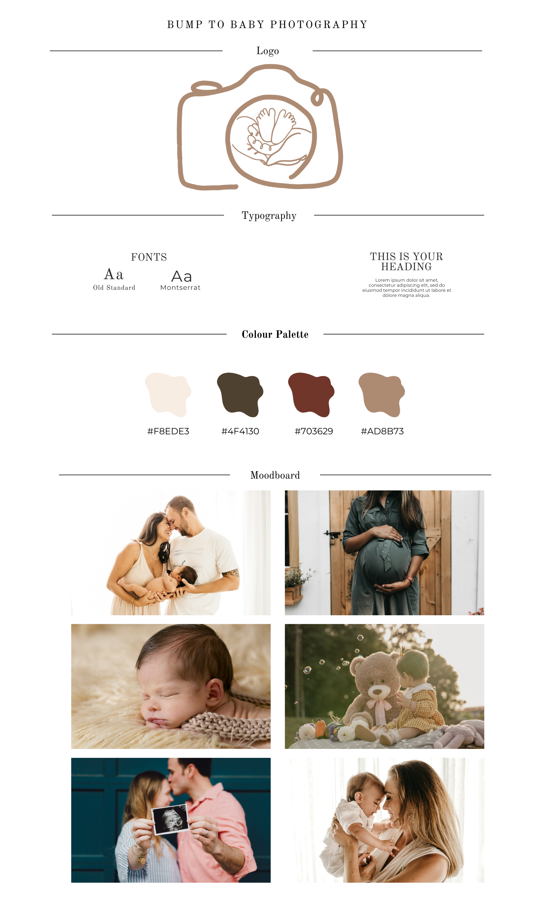

# Bump to Baby Photography

Bump to Baby Photography offers pregnancy, newborn, baby and family photography. The website allows you to view past work and includes an introduction to sofia, the photographer behind the business. Additionally, you can explore the services provides and read testimonials from previous clients. 

The site also features an enqiry form, studio contact details, opening times, social media information and location information. However, this is only the first iteration of the Bump to Baby Photography website - additional sections including a gallery and a price & packages section, will be added in the future, please see the wireframes for further details.

## [Live Website](https://sophielrt.github.io/Bump-To-Baby-Photography/)

## Code Institute - Milestone One Project: User Centric Frontend Development

This website was developed for my Milestone One project to showcase my ability to build a static front-end site to present useful information to users using HTML and CSS.

## Table of contents
1. [UX](#ux)
  - [Business Goals](#businessgoals)
  - [Target Users](#target-users)
  - [User Stories](#userstories)
  - [Strategy](#strategy)
  - [Scope](#scope)
  - [Structure](#structure)
  - [Skelton](#skelton)
  - [Surface](#surface)
2. [Features](#features)
3. [Technologies](#technologies)
4. [Testing](#testing)
  - [Manual Testing](#manual-testing)
  - [Validator Testing](#validator-testing)
  - [Google Light House Testing](#google-light-house-testing)
  - [Web Accessibility in mind Contrast Checker](#web-accessibility-in-mind-contrast-checker)
5. [Bugs](#bugs)
6. [Deployment](#deployment)
7. [Credit](#credit)
  - [Content](#content)
  - [Media](#Media)
  - [Code](#code)
  - [Acknowledgements](#acknowledgements)

## UX

### Business Goals
1. #### Attracting Potential Customers
   - Ensure relevant Meta data is used to Optimize search engine optimisation (SEO) to reach customers searching for photography services. 
2. #### Engaging Potential Customers
   - Showcase work through high-qaulity imagery.
   - Ensure the content is suitable for the target market.
   - Create a user-freindly interface which is easy to navigate.
   - Include key information to engage customers.
3. #### Converting Vistors into Bookings
   - Provide a simple and intutive enquiry system for potential customers.
4. #### Business & Customer Relationship
   - Add a personal touch with an engaging "About Me" section.
   - Include testimonails from previous customers to build trust.
6. #### Provide Easy methods for customers to contact
   - Have a clear and accessible contact section.
   - Offer mutliple contact methods to accommodate different customer preferences.
   - Display the studio's location using a map to help users find us easily.

### Target Users
1. #### Expecting Parents
   - Couples or single parents who are expecting a baby and looking for maternity and/or newborn photography.
   - They want maternity photography to document their pregnancy journey and/or newborn photography to capture their baby's arrival

2. #### New Parents (After Birth)
   - Parents who have recently had a baby and want to document this special time with a professional photoshoot.
   - They may use newborn photography to announce their baby's birth or simple to perserve these precious moments.

3. #### Parents looking for Milestone Baby Photography
   - Parents who want to document they key stages of their baby's first year.
   - They want milestone photography to capture these precious moments of their first year.

4. #### Families looking for Baby and Family Photography
    - Families who want to document the new addition to their family. This may include parents and siblings who want to capture these special moments together.

5. #### Friends and Family looking for a gift(newborn gift, baby, shower gift)
    - Friends or family members who want to gift a photography session to expecting or new parents.

### User Stories
1. As a customer, I want to view high-qailty images of the photgrapher's previous photoshoots so I can asses the qaulity of there work.
2. As a customer, I want to navigate the website easily, ensuring it's user-friendly and responsive across different devices.
3. As a customer, I want the information on the website to be clearly laid out so I can find what I need quickly.
4. As a customer, I want to learn more about the photographer, including their background and experience, so I can trust their expertise.
5. As a customer, I want to see a list of services provided, so I can decide which option best suit my needs.
6. As a customer, I want to read testimonials from previous customers, so I can get an idea od the photographer's reputation and the qaulity of service.
7. As a customer, I want to view the studio's opening times and contain details, so I can easily contact them or plan my visit.
8. As a customer, I want to be able to fill out an enquiry form, so I canm ask questions, book a session or request more information directly and quickly.
9. As a customer, I want to easily access the photography studio's social media profiles, so I can follow and see their latest work and updates.

### Strategy
### Scope
### Structure
### Skelton
### Surface

## Features

## Technologies
1. HTML5 - Used as the framework for structuring the website and containing its content.
2. CSS3 - Applied for styling, layout and overall visual design.
3. [Bootstrap V5.3](https://getbootstrap.com/) - Used to create a responsive website suitable for all screen sizes, utilizing pre-designed components and Bootstrap’s utility classes.
4. [Google Fonts](https://fonts.google.com/) - Used to enhance typography with custom fonts.
5. [Font Awesome](https://fontawesome.com/) - Provides a wide range of icons for better UI/UX.

## Testing

### Manual Testing

#### 1. Home Page Manual Testing

| **Test Description** | **Expected Result** | **Outcome** |
| ------------- | ------------- |:-----:|
| Click on the "About me" link in the navigation | You should be taken to the About me section | Pass |
| Click on the "Services" link in the navigation | You should be taken to the Services section | Pass |
| Click on the "Testimonials" link in the navigation | You should be taken to the Testimonials section | Pass |
| Click on the "Contact" link in the navigation | You should be taken to the contact section on the current page | Pass |
| Click on the "Enquire now" button in the navigation | You should be taken to the enquiry form | Pass |
| Check that the carousel autoplays | The carousel should autoplay on its own | Pass |
| Click on the prev and next buttons on the carousel | The carousel moves on a timer but using the buttons will allow you to skip forward or backwards | Pass |
| Click on the "Enquire now" button below the carousel | You should be taken to the enquiry form | Pass |
| Click on the "Enquire now" buttom below the services section | You should be taken to the enquiry form | Pass |
| Check that the Testomonials carousel autoplays | The carousel should autoplay on its own | Pass |
| Click on the prev and next button on the Testimonials carousel | The carousel moves on a timer but using the buttons will allow you to skip forward or backwards | Pass |
| Fill out the form with invaild details | The form will not let you continue and will display and error message informing you of what you need to do | Pass |
| Fill out the form with vail details and press the submit button | You should be taken to the form submission page and with be shown a submission message | Pass |
| Click on the "Facebook" button in the footer | Facebook should load in a seperate tab | Pass |
| Click on the "Instagram" button in the footer | Instagram should load in a seperate tab | Pass |
| Click on the  "x" button in the footer | X should load in a seperate tab  | Pass |
| Click onto the map and drag your mouse and use the zoom in and out buttons | The map should be allow you to freely drag your mouse to move the map and zoom in and out | Pass |

#### 2. Form Submission Page Manual Testing

| **Test Description** | **Expected Result** | **Outcome** |
| ------------- | ------------- |:-----:|
| Click on the logo in the navigation | Home page should load | Pass |
| Click on the brand name in the navigation | Home page should load | Pass |
| Click on the "Home" link in the navigation | Home page should load | Pass |
| Click on the "About me" link in the navigation | Home page should load and you should be taken to the About me section | Pass |
| Click on the "Services" link in the navigation | Home page should load and you should be taken to the Services section | Pass |
| Click on the "Testimonials" link in the navigation | Home page should load and you should be taken to the Testimonials section | Pass |
| Click on the "Contact" link in the navigation | You should be taken to the contact section on the current page | Pass |
| Click on the "Enquire now" button in the navigation | Home page should load and you should be taken to the enquiry form | Pass |
| Click on the "Home Page" button below the enqiry submission message | Home page should load | Pass |
| Click on the "Facebook" button in the footer | Facebook should load in a seperate tab |  Pass |
| Click on the "Instagram" button in the footer | Instagram should load in a seperate tab | Pass |
| Click on the  "x" button in the footer | X should load in a seperate tab  | Pass |
| Click onto the map and drag your mouse and use the zoom in and out buttons | The map should be allow you to freely drag your mouse to move the map and zoom in and out | Pass |

### Validator Testing

1. HTML validator - [W3C Markup Validator](https://validator.w3.org/)

### Google Light House Testing

## Bugs

## Deployment
This project was developed using [Visual Studio Code](https://code.visualstudio.com/). The project was then commited to git and pushed to [GitHub](https://github.com/) using git functions.

To delpoy this project from it [repository](https://github.com/sophielrt/Bump-To-Baby-Photography) to Github Pages, follow these steps:

1. Log into GitHub.
2. From the list of repositories, select **sophielrt/Bump-To-Baby-Photography**.
3. Under the repository name, click on the **Settings** tab.
4. Scroll down to the **Code and automations** section of the left sidebar and click **Pages**.
5. Under the **Build and delpoyment**, in the **Sources** section, click the drop-down menu labeled **None** and select **main/master branch**.
6. Once you select the **main/master branch**, the page will automatically refresh, meaning your website is now deployed.
7. Scroll back down to the **Github pages** section to retrieve the link to your deployed site.

### How to run this project locally

To clone this project into Gitpod, follow these steps:
1. Create a [Github](https://github.com/) account or log in.
2. Ensure you are using the **Chrome** browser.
3. Install the Gitpod browser extention for chrome: [Click to install browser extension](https://www.gitpod.io/docs/configure/user-settings/browser-extension).
4. After installing the Gitpod browser extension, restart your browser.
5. Create a [Gitpod](https://app.gitpod.io/login?redirect=%2F) account or log in. 
6. Go to the project [repository](https://github.com/sophielrt/Bump-To-Baby-Photography).
7. Click on the green Gitpod button (Gitpod logo) in the top right corner on your repository screen.
8. This will create a new Gitpod worksapce from the code in the repository, allowing you to work on it locally.

To clone this project from GitHub to a local IDE such as VSCode, Pycharm, etc., follow these steps:
1. Go to the project [repository](https://github.com/sophielrt/Bump-To-Baby-Photography).
2. Click on the green **Code** button in the top right corner of the repository screen.
3. Under the **Clone** section, Copy the repository's HTTPS UTL.
4. Open the terminal in your chosen local IDE.
5. Navigate to the directory where you want tto clone the repository. 
6. Type the **git clone** command, and paste the URL which was copied in step 3
git clone http://github.com/sophielrt/Bump-To-Baby-Photography
7. Press Enter, to create the local clone.

## Credit

### Content
[ChatGPT](https://chatgpt.com/) was used to generate the text for the Home Page and the Form Submission Page.

### Media

## Logo
- Bump-to-Baby-Logo.png
The Logo was created by Sophie Trainor using images from [Canva](https://www.canva.com/) and was edited by Hayley So in [Procreate](https://procreate.com/).

## Home Page
- Bump-to-Baby-Carousel-Image1.jpg Unsplash Photo by: Kelly Sikkema
- Bump-to-Baby-Carousel-Image2.jpg Unsplash Photo by: Camylla Battani
- Bump-to-Baby-Carousel-Image3.jpg Unsplash Photo by: Andrea Bertozzini
- Bump-to-Baby-Carousel-Image4.jpg Unsplash Photo by: Gigin Krishnan
- Bump-to-Baby-Carousel-Image5.jpg Unsplash Photo by: Ciprian Sam
- Bump-to-Baby-Carousel-Image6.jpg Unsplash Photo by: Luma Pimentel
- Bump-to-Baby-Carousel-Image7.jpg Unsplash Photo by: Isaac Quesada
- Bump-to-Baby-Carousel-Image8.jpg Unsplash Photo by: Jonathan Borba
- Bump-to-Baby-Carousel-Image9.jpg Unsplash Photo by: Jonathan Borba
- Bump-to-Baby-Carousel-Image10.jpg Unsplash Photo by: Travis Grossen
- Bump-to-Baby-AboutMe.jpg Unsplash Photo by: Marco Xu
- Bump-to-Baby-Services-Image1.jpg Unsplash Photo by: Freddy G
- Bump-to-Baby-Services-Image2.jpg Unsplash Photo by: Rodolfo Allen
- Bump-to-Baby-Services-Image3.jpg Unsplash Photo by: Lonela Mat
- Bump-to-Baby-Services-Image4.jpg Unsplash Photo by: Zach Lucero
- Bump-to-Baby-Testiomals-Image1.jpg Unsplash Photo by: Max Böhme
- Bump-to-Baby-Testiomals-Image2.jpg Unsplash Photo by: Gigin Krishnan
- Bump-to-Baby-Testiomals-Image3.jpg Unsplash Photo by: Shadab Khan
- Bump-to-Baby-Testiomals-Image4.jpg Unsplash Photo by: Nilanka Kariyawasam
- Bump-to-Baby-Testiomals-Image5.jpg Unsplash Photo by: Gigin Krishnan
- Bump-to-Baby-Testiomals-Image6.jpg Unsplash Photo by: Jonathan Borba

### Code

### Acknowledgements

