# Bump to Baby Photography

Bump to Baby Photography offers pregnancy, newborn, baby and family photography. The website allows you to view past work and includes an introduction to Sofia, the photographer behind the business. Additionally, you can explore the services provided and read testimonials from previous clients. 

The site also features an enquiry form, studio contact details, opening times, social media information and location information. However, this is only the first iteration of the Bump to Baby Photography website - additional sections including a gallery and a prices & packages section, will be added in the future.

## [Live Website](https://sophielrt.github.io/Bump-To-Baby-Photography/)

## Code Institute - Milestone One Project: User-Centric Frontend Development

This website was developed for my Milestone One project to showcase my ability to build a static front-end site to present useful information to users using HTML and CSS.

## Table of contents
1. [UX](#ux)
   - [Business Goals](#business-goals)
   - [Target Users](#target-users)
   - [User Stories](#user-stories)
   - [Design Choices](#design-choices)
   - [Wireframe](#wireframe)
2. [Features](#features)
3. [Technologies](#technologies)
4. [Testing](#testing)
   - [Manual Testing](#manual-testing)
   - [Validator Testing](#validator-testing)
   - [Google Lighthouse Testing](#google-lighthouse-testing)
   - [Web Accessibility in mind Contrast Checker](#web-accessibility-in-mind-contrast-checker)
5. [Bugs](#bugs)
6. [Deployment](#deployment)
7. [Credit](#credit)
   - [Content](#content)
   - [Media](#media)
   - [Code](#code)
   - [Acknowledgements](#acknowledgements)

## UX
The user experience (UX) of Bump to Baby Photography is designed to prioritize simplicity, accessibility, and intuitive navigation, ensuring an optimal and seamless experience for all users.

### Business Goals
1. #### Attracting Potential Customers
   - Ensure relevant Meta data is used to Optimize search engine optimisation (SEO) to reach customers searching for photography services. 
2. #### Engaging Potential Customers
   - Showcase work through high-quality imagery.
   - Ensure the content is suitable for the target market.
   - Create a user-friendly interface which is easy to navigate.
   - Include key information to engage customers.
3. #### Converting Visitors into Bookings
   - Provide a simple and intuitive enquiry system for potential customers.
4. #### Business & Customer Relationship
   - Add a personal touch with an engaging "About Me" section.
   - Include testimonials from previous customers to build trust.
6. #### Provide Easy methods for customers to contact
   - Have a clear and accessible contact section.
   - Offer multiple contact methods to accommodate different customer preferences.
   - Display the studio's location using a map to help users find us easily.

### Target Users
1. #### Expecting Parents
   - Couples or single parents who are expecting a baby and looking for maternity and/or newborn photography.
   - They want maternity photography to document their pregnancy journey and/or newborn photography to capture their baby's arrival.

2. #### New Parents (After Birth)
   - Parents who have recently had a baby and want to document this special time with a professional photoshoot.
   - They may use newborn photography to announce their baby's birth or simple to preserve these precious moments.

3. #### Parents looking for Milestone Baby Photography
   - Parents who want to document they key stages of their baby's first year.
   - They want milestone photography to capture these precious moments of their first year.

4. #### Families looking for Baby and Family Photography
   - Families who want to document the new addition to their family. This may include parents and siblings who want to capture these special moments together.

5. #### Friends and Family looking for a gift(newborn gift, baby, shower gift)
   - Friends or family members who want to gift a photography session to expecting or new parents.

### User Stories
1. As a customer, I want to view high-quality images of the photographer's previous photoshoots so I can assess the quality of their work.
2. As a customer, I want to navigate the website easily, ensuring it's user-friendly and responsive across different devices.
3. As a customer, I want the information on the website to be clearly laid out so I can find what I need quickly.
4. As a customer, I want to learn more about the photographer, including their background and experience, so I can trust their expertise.
5. As a customer, I want to see a list of services provided, so I can decide which option best suit my needs.
6. As a customer, I want to read testimonials from previous customers, so I can get an idea of the photographer's reputation and the quality of service.
7. As a customer, I want to view the studio's opening times and contact details, so I can easily contact them or plan my visit.
8. As a customer, I want to be able to fill out an enquiry form, so I can ask questions, book a session or request more information directly and quickly.
9. As a customer, I want to easily access the photography studio's social media profiles, so I can follow and see their latest work and updates.

### Design Choices

1. Typography
   - Old Standard TT has been chosen for the headings on the website due to its timeless and traditional look. This often evokes a sense of trustworthiness and reliability, which is the feeling we want users to experience. It is also highly accessible, as it is legible and easy to read, with broad support across different browsers. 
   - Monstserrat has been selected as the primary font of the website's content because of its sleek, clean appearance, making it ideal for larger amounts of text. It is highly accessible as well, with excellent legibility and ease of reading, and is widely supported across different browsers.

2. Colour Palette
   - The colour palette was selected to create a warm, neutral atmosphere, fostering a welcoming and comfortable environment. These soft, tones mirror the calm and intimate nature of maternity and baby photography.
   - This colour palette is well-suited to the website, as it evokes a sense of calm, whilst ensuring readability and accessibility, ultimately contributing to an overall positive user experience.
   - This colour palette also complements the nurturing essence of the service offered, helping to create an inviting space for expecting parents.

3. Images
   - All images used were carefully selected to ensure they are of high-quality.
   - Images were chosen to resonate with the users and attract them to become customers.
   - The images were carefully selected to ensure they represent the section in which they are place and reflect the content accurately.

### Wireframe
I designed the wireframe using Balsamiq. After creating the homepage wireframe and discussing it with my mentor, it was decided to focus solely on the homepage for this iteration. Additionally, a services section was added in between the "About Me" and "Testimonials" section to better structure the content, as this is currently a one-page website.
[Home Page Wireframe](./assets/read.me.assets/read.me-homepagewireframe.pdf)

## Features
1. #### Navigation Bar
   - It is fixed to the top of the page to ensure it is always accessible while scrolling.
   - It aligns with the page content to maintain a clean and visually appealing design.
   - The logo is positioned on the left side of the navigation bar, with the brand name in the centre; both link to the index.html page.
   - Navigation links are on the right side of the navigation bar,
    directing the users either to a new page or a specific section of the current page.
   - A call-to-action button ("Enquire now") is positioned on the right side of the navigation bar to encourage users to make enquiries.
   - The active attribute is applied to the current, making the corresponding navigation link bold to indicate the user's location.
   - The hover effect is added to the navigation links and the call-to-action button to enhance user experience.
   - It is responsive on smaller devices such as phones and tablets, it changes to a hamburger menu with the icon positioned in the right-hand corner.

2. #### Carousel
   - Displays a collection of 10 high-quality images related to pregnancy, newborns, and babies.
   - Uses Bootstrap's carousel component to transition between images.
   - The first image is set as active, meaning it is the first image visitors see when they arrive on the website.
   - The carousel automatically transitions between images.
   - Users can override the automatic transitions and manually navigate using the previous and next buttons.
   - Below the carousel, a short description emphasises the emotional aspect of the images.
   - A call-to-action button ("Enquire now) is positioned beneath the carousel text, encouraging users to reach out via the enquiry form.
   - The hover effect is added to the call-to-action button to enhance user experience.

3. #### About me
   - Displays a high-quality image to visually introduce the photographer.
   - Two-column responsive design using the grid system.
   - An engaging and welcoming personal introduction to the photographer, highlighting her passion, specialization and experience.
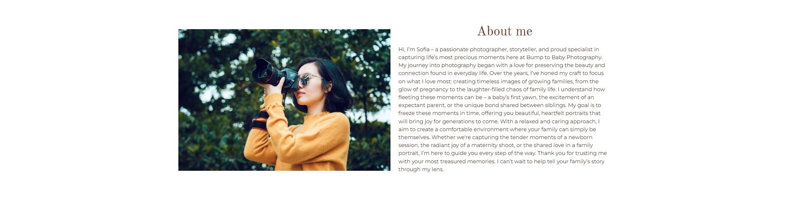

4. #### Services
   - Has 4 cards that contain high-quality image and details of each service.
   - Uses the grid system to ensure the design is responsive and adapts to different screen sizes.
   - A call-to-action button ("Enquire now") is position beneath the 4 services cards, encouraging users to reach out via the enquiry form.
   - The hover effect is added to the call-to-action button to enhance user experience.
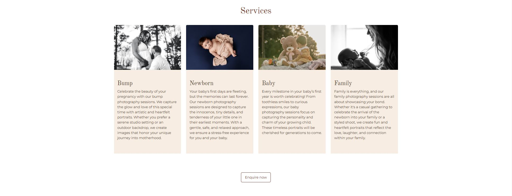

5. #### Behind the scenes video
- The section includes explanatory text inviting users to join the behind-the-scenes experience of the photoshoot.
- A Font Awesome play icon button is provided which triggers the modal containing the video when clicked.
- The video is displayed within a Bootstrap 5 modal. Once users finish watching the video, they can close the modal by clicking on a Font Awesome "X" icon and return to the home page.
- The video uses both MP4 and WEBM formats to ensure compatibility and accessibility across different browsers.
- The video is muted by default, but users have the option to unmute it using the video controls provided.
- The Modal is designed to be responsive, adapting to various screen sizes ensure positive user experience across different devices.

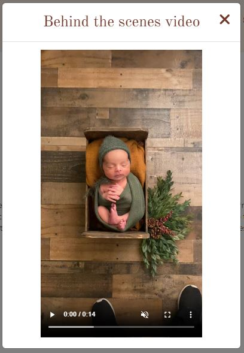

6. #### Testimonials
   - This section uses a carousel to display multiple testimonials.
   - The carousel automatically transitions between testimonials, but users can manually navigate through testimonials using the previous and next buttons.
   - Each testimonial is placed within a card, which includes image, name, testimonial and star ratings.
   - Each testimonial uses a high-quality image of the client's photoshoot, adding a personal touch and authenticity.
   - Each testimonial includes a star rating (from 1 to 5 stars) represented by Font Awesome Stars.
   - The grid system ensure that the testimonials are responsive and adapt to different screen sizes.
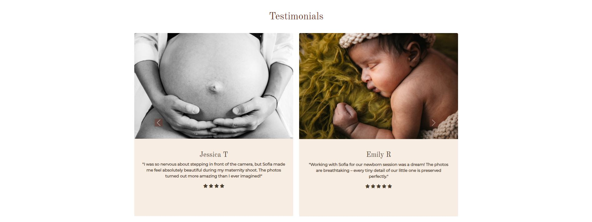

7. #### Enquiry Form
   - Introduction text describing the importance of maternity and newborn photography, inviting user to submit the form.
   - The grid system ensures that the enquiry form is responsive and works effectively on different screen sizes.
   - Includes form fields for full name (text input), phone number (number input), email address (email input) and message (text input).
   - Form fields include required attribute, ensuring that users can not submit the form without filling all fields correctly.
   - The form sends a GET request, redirecting the user to a form submission page once they press the submit button.
   - The submit button allows the user to submit the form and be redirected to the form submission page.
   - A hover effect is applied to the submit button to enhance user experience.

8. #### Enquiry Form Submission Page Message
   - Displays a thank you message for users who has successfully submitted the form.
   - Headline thanking users for their enquiry.
   - Message including personal text from the photographer, expressing excitement about being part of the user's journey.
   - Explains next steps, informing the user they will be contacted within 24-48 hours.
   - Call-to-action button that navigates the user back to the Home Page.
   - A hover effect applied to the call-to-action button to enhance user experience.
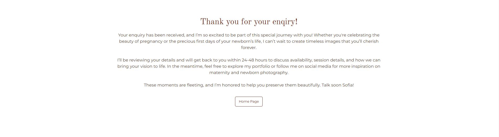

9. #### Contact Us Footer
   - Contact information including business address, phone number, and email address.
   - Contact information has uses Font Awesome icons for location, phone number and email to enhance user experience and visual appeal.
   - Studio opening times are clearly displayed in a table
   - Font Awesome icons are used for social media logos. Each icon links to the platform's social media page and open in a new tab.
   - A hover effect is applied to the social media icons to enhance user experience.
   - Embedded Google Map shows the user the location of the Bump to Baby Photography studio.
   - The embedded Google Map is responsive.
   - The grid system ensures that the section is responsive and adapts to different screen sizes.
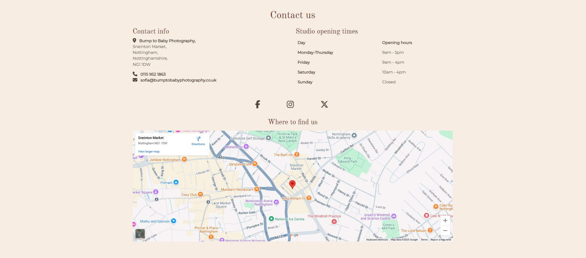

## Technologies
1. HTML5 - Used as the framework for structuring the website and containing its content.
2. CSS3 - Applied for styling, layout and overall visual design.
3. [Bootstrap V5.3](https://getbootstrap.com/) - Used to create a responsive website suitable for all screen sizes, utilizing pre-designed components and Bootstrap’s utility classes.
4. [Google Fonts](https://fonts.google.com/) - Used to enhance typography with custom fonts.
5. [Font Awesome](https://fontawesome.com/) - Provides a wide range of icons for better UI/UX.
6. [TinyPNG](https://tinypng.com/) - Reduces image file size.
7. [Squoosh](https://squoosh.app/) - Reduces image file size.
8. [cloudconvert](https://cloudconvert.com/) - Used to convert a video from a mp4 to a webm.

## Testing

### Manual Testing

#### 1. Home Page Manual Testing

| **Test Description** | **Expected Result** | **Outcome** |
| ------------- | ------------- |:-----:|
| Click on the "About me" link in the navigation | You should be taken to the About me section | Pass |
| Click on the "Services" link in the navigation | You should be taken to the Services section | Pass |
| Click on the "Testimonials" link in the navigation | You should be taken to the Testimonials section | Pass |
| Click on the "Contact" link in the navigation | You should be taken to the contact section on the current page | Pass |
| Click on the "Enquire now" button in the navigation | You should be taken to the enquiry form | Pass |
| Check that the carousel autoplay's | The carousel should autoplay on its own | Pass |
| Click on the prev and next buttons on the carousel | The carousel moves on a timer but using the buttons will allow you to skip forward or backwards | Pass |
| Click on the "Enquire now" button below the carousel | You should be taken to the enquiry form | Pass |
| Click on the "Enquire now" button below the services section | You should be taken to the enquiry form | Pass |
| Click on the play button in the behind the scenes section | The video modal should open | Pass |
| Click on the video play button in the behind the scenes modal | The video should play | Pass |
| Click on the video volume button in the behind the scenes modal | The video should un-mute and you will hear the video sound | Pass |
| Click on the full screen button in the behind the scenes modal | The video should go to full screen | Pass |
| Click on the cross in the top right corner of the behind the scenes modal | The modal should close and you will be back to the behind the scenes section on the home page | Pass |
| Check that the Testimonials carousel autoplay's | The carousel should autoplay on its own | Pass |
| Click on the prev and next button on the Testimonials carousel | The carousel moves on a timer but using the buttons will allow you to skip forward or backwards | Pass |
| Fill out the form with invalid details | The form will not let you continue and will display and error message informing you of what you need to do | Pass |
| Fill out the form with vail details and press the submit button | You should be taken to the form submission page and with be shown a submission message | Pass |
| Click on the "Facebook" button in the footer | Facebook should load in a separate tab | Pass |
| Click on the "Instagram" button in the footer | Instagram should load in a separate tab | Pass |
| Click on the "x" button in the footer | X should load in a separate tab  | Pass |
| Click onto the map and drag your mouse and use the zoom in and out buttons | The map should allow you to freely drag your mouse to move the map and zoom in and out | Pass |
| In the inspect tab check the homepage break-points | The homepage should be full responsive on all devices | Pass |

#### 2. Form Submission Page Manual Testing

| **Test Description** | **Expected Result** | **Outcome** |
| ------------- | ------------- |:-----:|
| Click on the logo in the navigation | Home page should load | Pass |
| Click on the brand name in the navigation | Home page should load | Pass |
| Click on the "Home" link in the navigation | Home page should load, | Pass |
| Click on the "About me" link in the navigation | Home page should load, and you should be taken to the About me section | Pass |
| Click on the "Services" link in the navigation | Home page should load ,and you should be taken to the Services section | Pass |
| Click on the "Testimonials" link in the navigation | Home page should ,load and you should be taken to the Testimonials section | Pass |
| Click on the "Contact" link in the navigation | You should be taken to the contact section on the current page | Pass |
| Click on the "Enquire now" button in the navigation | Home page should load, and you should be taken to the enquiry form | Pass |
| Click on the "Home Page" button below the enquiry submission message | Home page should load, | Pass |
| Click on the "Facebook" button in the footer | Facebook should load in a separate tab | Pass |
| Click on the "Instagram" button in the footer | Instagram should load in a separate tab | Pass |
| Click on the "x" button in the footer | X should load in a separate tab  | Pass |
| Click onto the map and drag your mouse and use the zoom in and out buttons | The map should be allow you to freely drag your mouse to move the map and zoom in and out | Pass |
| In the inspect tab check the submission page break-points | The submission page should be full responsive on all devices | Pass |

### Validator Testing

1. HTML validator - [W3C Markup Validator](https://validator.w3.org/)
    - The following Pages were validated:
       - index.html
       - formsubmission.html 
   Html validator test passed no errors or warnings.
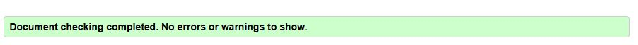

2. CSS Validator - [W3C CSS Validator](https://jigsaw.w3.org/css-validator/)
    - CSS validator test passed no errors found.
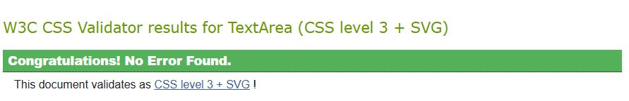

### Google Lighthouse Testing

1. index.html results:
    - Performance: 93/100
    - Accessibility: 100/100
    - Best Practices: 100/100
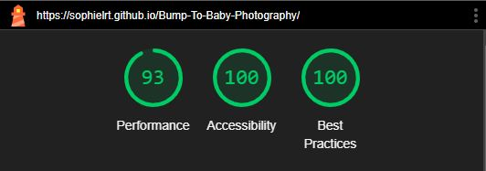

2. formsubmission.html results:
    - Performance: 97/100
    - Accessibility: 100/100
    - Best Practices: 100/100
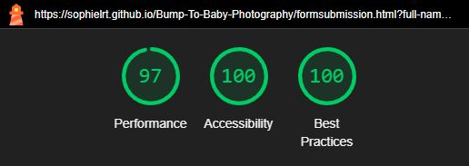

### Web Accessibility in mind Contrast Checker
[Web Accessibility in mind contrast checker](https://webaim.org/resources/contrastchecker/?fcolor=02AFD0&bcolor=FFFF00)

- All contrast checkers where passed, meaning that these colours meet website accessibility standards for suitability and readability.

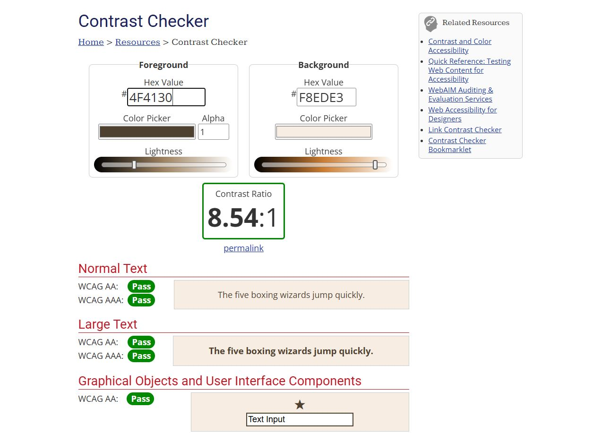
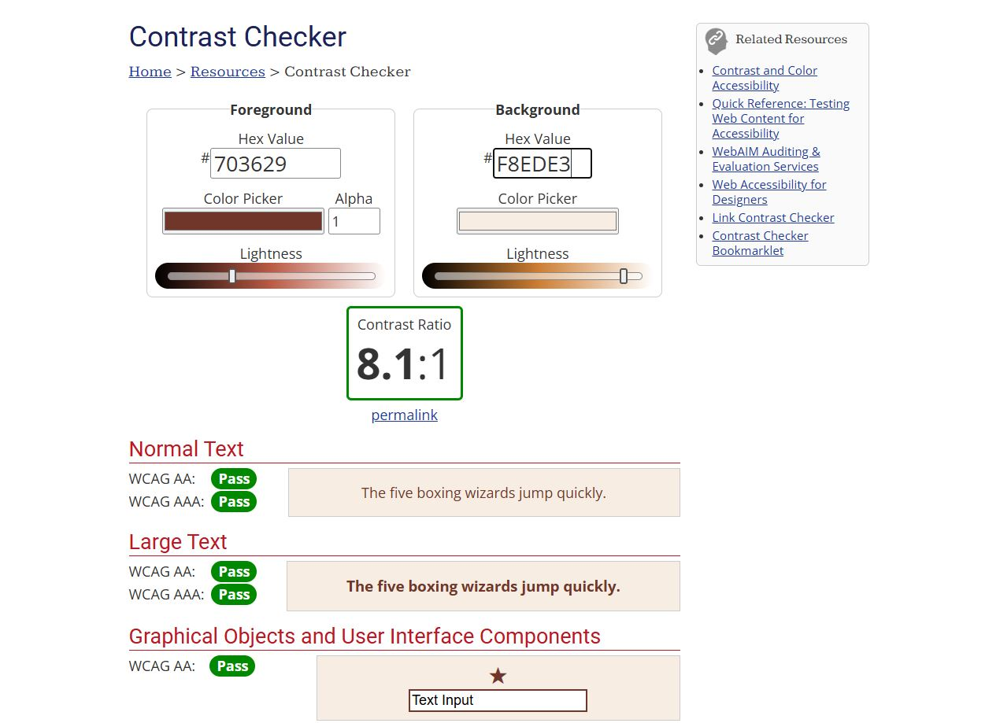
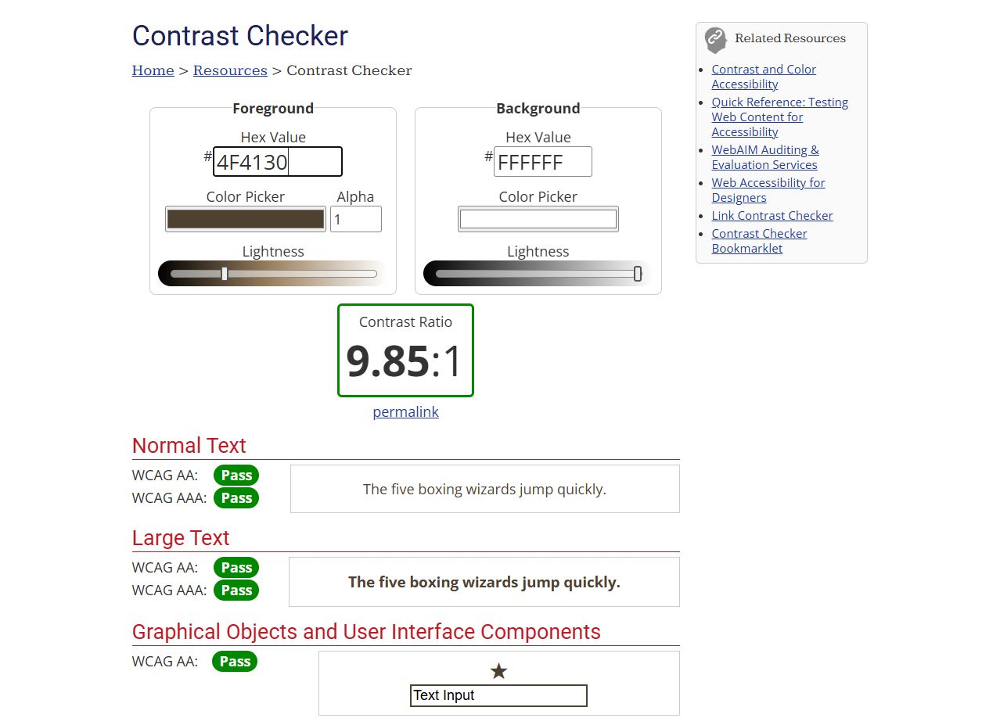
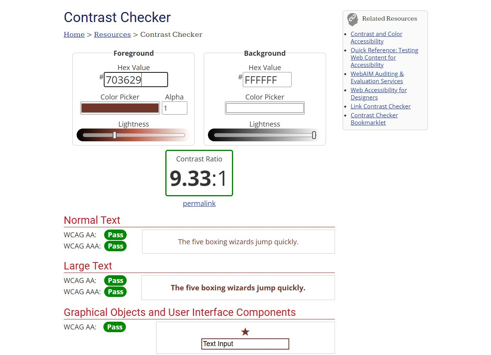

## Bugs
1. The first bug I encountered was with my testimonial's carousel. The control where not working, meaning it would autoplay, but users couldn't manually navigate it. The issue occurred because I had two carousels with controls using the same ID's, causing the testimonials carousel to be overridden by the first one. Once I assigned unique identifying properties to each carousel, they functioned independently, with controls correctly targeting their respective elements using the data-bs-target property.
2. The second bug I encountered was with the testimonials link in the navigation bar. The ID was misspelled in the navigation link; however, it still directed users to the testimonials section on the page. The issue was that the link appeared black when clicked instead of matching the colour of the other links. Once the spelling error was corrected, the testimonials navigation link functioned as expected.

## Deployment
This project was developed using [Visual Studio Code](https://code.visualstudio.com/). The project was then committed to git and pushed to [GitHub](https://github.com/) using git functions.

To deploy this project from it [repository](https://github.com/sophielrt/Bump-To-Baby-Photography) to GitH ub Pages, follow these steps:

1. Log into GitHub.
2. From the list of repositories, select **sophielrt/Bump-To-Baby-Photography**.
3. Under the repository name, click on the **Settings** tab.
4. Scroll down to the **Code and automations** section of the left sidebar and click **Pages**.
5. Under the **Build and deployment**, in the **Sources** section, click the drop-down menu labelled **None** and select **main/master branch**.
6. Once you select the **main/master branch**, the page will automatically refresh, meaning your website is now deployed.
7. Scroll back down to the **GitHub pages** section to retrieve the link to your deployed site.

### How to run this project locally

To clone this project into Gitpod, follow these steps:
1. Create a [GitHub](https://github.com/) account or log in.
2. Ensure you are using the **Chrome** browser.
3. Install the Gitpod browser extension for chrome: [Click to install browser extension](https://www.gitpod.io/docs/configure/user-settings/browser-extension).
4. After installing the Gitpod browser extension, restart your browser.
5. Create a [Gitpod](https://app.gitpod.io/login?redirect=%2F) account or log in. 
6. Go to the project [repository](https://github.com/sophielrt/Bump-To-Baby-Photography).
7. Click on the green Gitpod button (Gitpod logo) in the top right corner on your repository screen.
8. This will create a new Gitpod workspace from the code in the repository, allowing you to work on it locally.

To clone this project from GitHub to a local IDE such as VSCode, PyCharm, etc., follow these steps:
1. Go to the project [repository](https://github.com/sophielrt/Bump-To-Baby-Photography).
2. Click on the green **Code** button in the top right corner of the repository screen.
3. Under the **Clone** section, Copy the repository's HTTPS UTL.
4. Open the terminal in your chosen local IDE.
5. Navigate to the directory where you want to clone the repository. 
6. Type the **git clone** command, and paste the URL which was copied in step 3
git clone http://github.com/sophielrt/Bump-To-Baby-Photography
7. Press Enter, to create the local clone.

## Credit

### Content
[ChatGPT](https://chatgpt.com/) was used to generate the text for the Home Page and the Form Submission Page.

### Media

## Logo
- Bump-to-Baby-Logo.png
The Logo was created by Sophie Trainor using images from [Canva](https://www.canva.com/) and was edited by Hayley So in [Procreate](https://procreate.com/).

## Home Page
- bump-to-baby-carousel-image1.jpg Unsplash Photo by: Kelly Sikkema
- bump-to-baby-carousel-image2.jpg Unsplash Photo by: Camylla Battani
- bump-to-baby-carousel-image3.jpg Unsplash Photo by: Andrea Bertozzini
- bump-to-baby-carousel-image4.jpg Unsplash Photo by: Gigin Krishnan
- bump-to-baby-carousel-image5.jpg Unsplash Photo by: Ciprian Sam
- bump-to-baby-carousel-image6.jpg Unsplash Photo by: Luma Pimentel
- bump-to-baby-carousel-image7.jpg Unsplash Photo by: Isaac Quesada
- bump-to-baby-carousel-image8.jpg Unsplash Photo by: Jonathan Borba
- bump-to-baby-carousel-image9.jpg Unsplash Photo by: Jonathan Borba
- bump-to-baby-carousel-image10.jpg Unsplash Photo by: Travis Grossen
- bump-to-baby-aboutme.jpg Unsplash Photo by: Marco Xu
- bump-to-baby-services-image1.jpg Unsplash Photo by: Freddy G
- bump-to-baby-services-image2.jpg Unsplash Photo by: Rodolfo Allen
- bump-to-baby-services-image3.jpg Unsplash Photo by: Lonela Mat
- bump-to-baby-services-image4.jpg Unsplash Photo by: Zach Lucero
- bump-to-baby-testiomals-image1.jpg Unsplash Photo by: Max Böhme
- bump-to-baby-testiomals-image2.jpg Unsplash Photo by: Gigin Krishnan
- bump-to-baby-testiomals-image3.jpg Unsplash Photo by: Shadab Khan
- bump-to-baby-testiomals-image4.jpg Unsplash Photo by: Nilanka Kariyawasam
- bump-to-baby-testiomals-image5.jpg Unsplash Photo by: Gigin Krishnan
- bump-to-baby-testiomals-image6.jpg Unsplash Photo by: Jonathan Borba
- bump-to-baby-photography-video.mp4 Pexels Video by: Ivette Garziia
- bump-to-baby-photography-video.webm Pexels Video by: Ivette Garziia                

### Code
- Bootstrap V5.3
- W3schools
- Stack overflow
- Youtube Video OnlinelTtuts Tutorials (iframe)
- Jamie Juviler Step-By-Step-Guide HubSpot Blog (iframe)
- Geeks for Geeks (Logo Icon and Testimonials)
- Coding Year (Bootstrap Burger Icon NavBar Colour Change)

### Acknowledgements
- I would like to extend my gratitude to my New City College tutor, Andre Beckley, for his invaluable guidance.
- Special thanks to my Code Institute mentor, Medale Oluwafemi, for their invaluable support and insights throughout the project.
- My sincere appreciation goes to the tutor team at the Code Institute for their continued assistance.
- The ideas presented were inspired by the Code Institute's Broadwalk Games and Love Running walkthrough projects.

